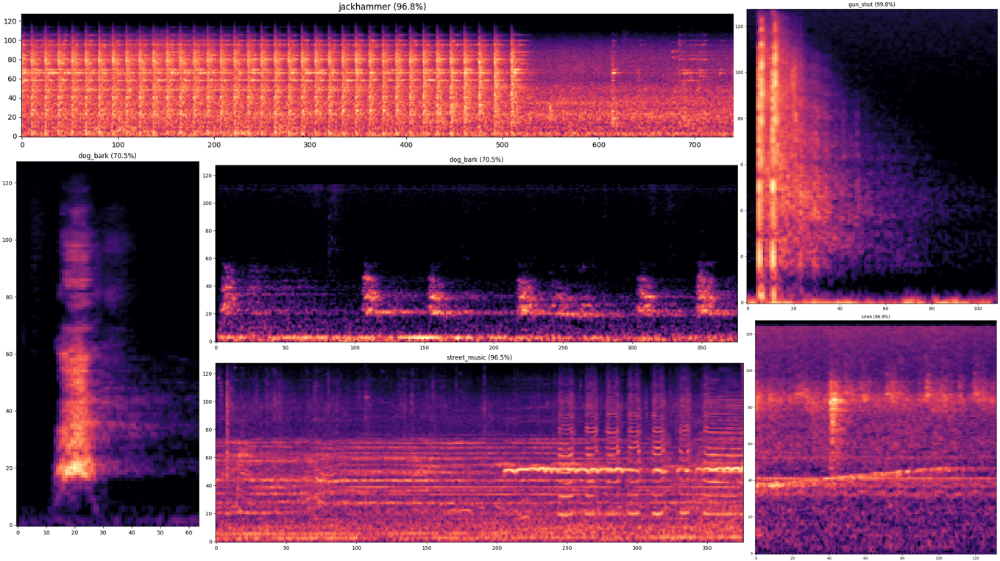
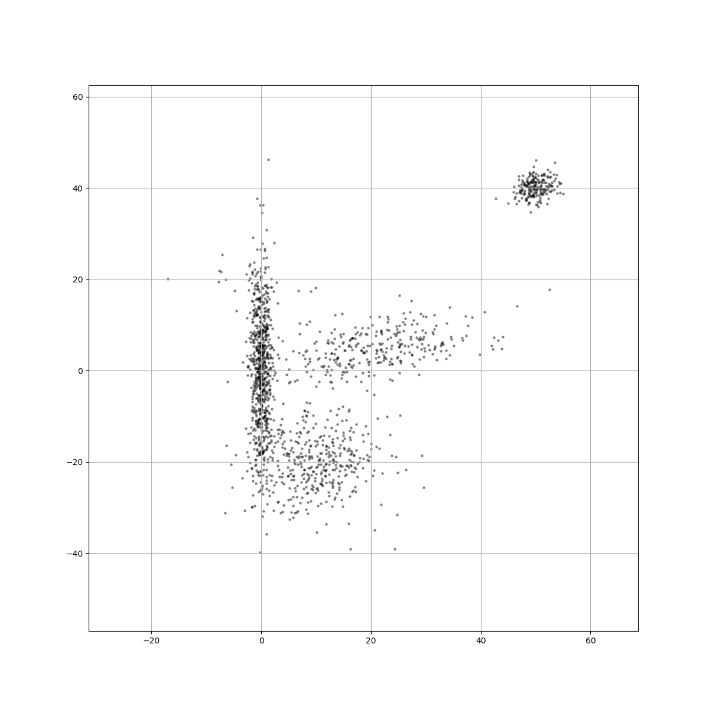
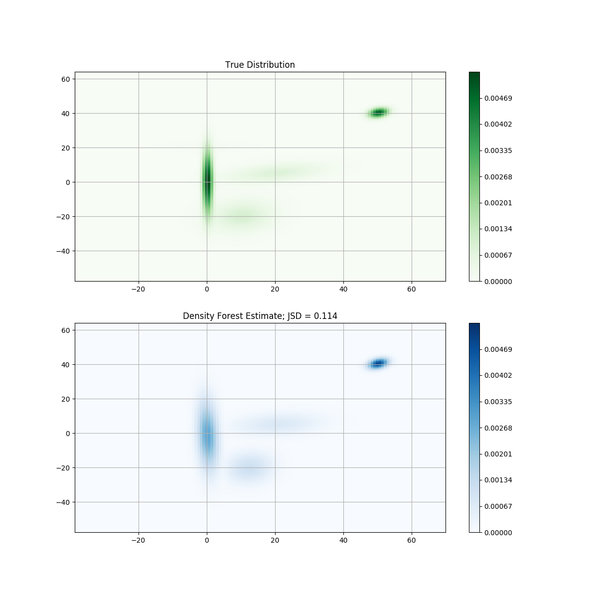
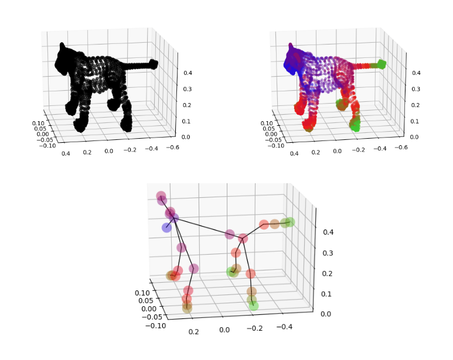
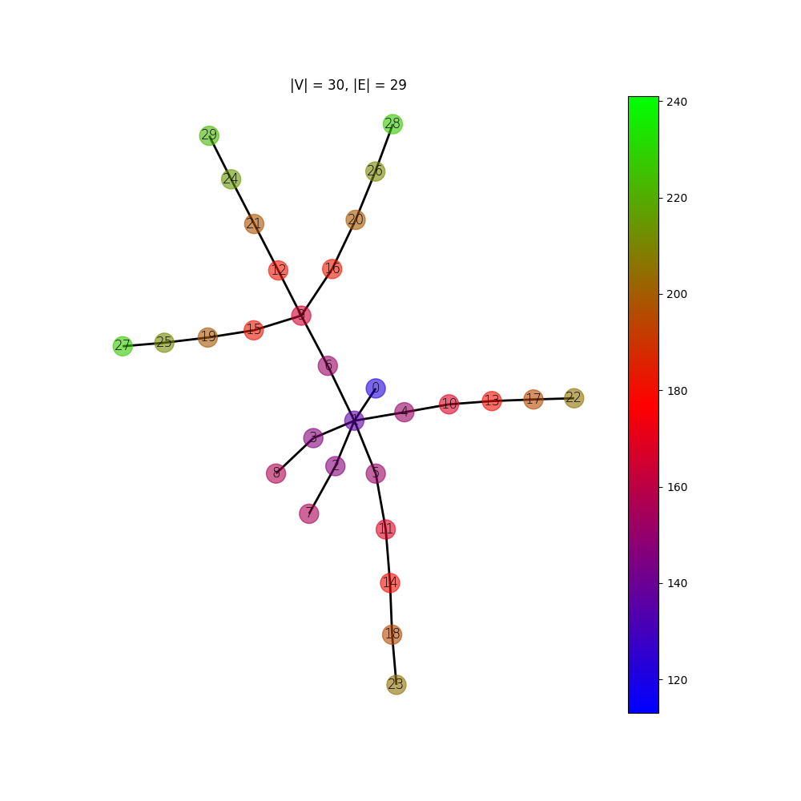

# projects

### [crnn-audio-classification](https://github.com/ksanjeevan/crnn-audio-classification)
pytorch Spectrogram + CNN + LSTM networks for audio classification on the [UrbanSound8K](https://urbansounddataset.weebly.com/urbansound8k.html) dataset

------

### [dourflow](https://github.com/ksanjeevan/dourflow)
keras / tensorflow implementation of the state-of-the-art object detection system [_You only look once_](https://pjreddie.com/darknet/yolo/)

------

### [randomforest-density-python](https://github.com/ksanjeevan/randomforest-density-python)
density estimation using [random forests](https://en.wikipedia.org/wiki/Random_forest) and [kernel density estimation](https://en.wikipedia.org/wiki/Kernel_density_estimation)

------

### [mapper-tda](https://github.com/ksanjeevan/mapper-tda)
implementation of [_Mapper_](http://www.nature.com/articles/srep01236) (Topological Data Analysis technique) for extracting insights from high dimensional data

------