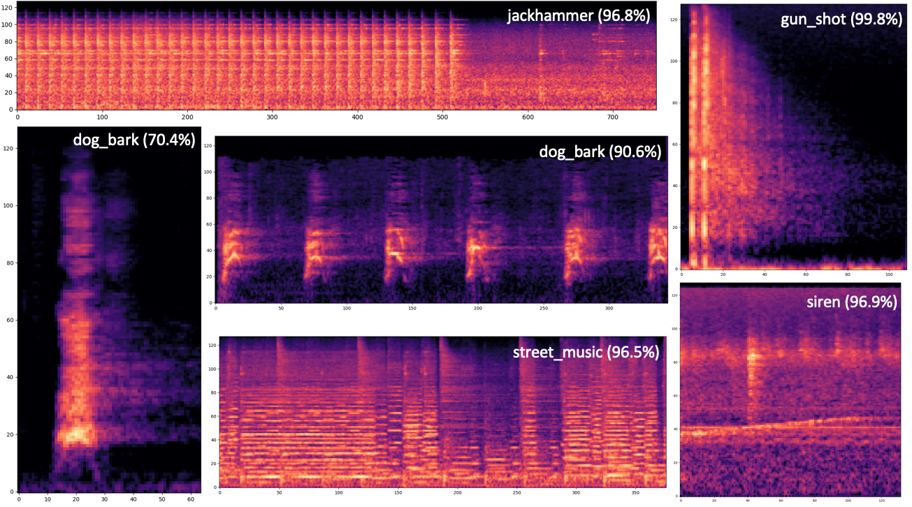
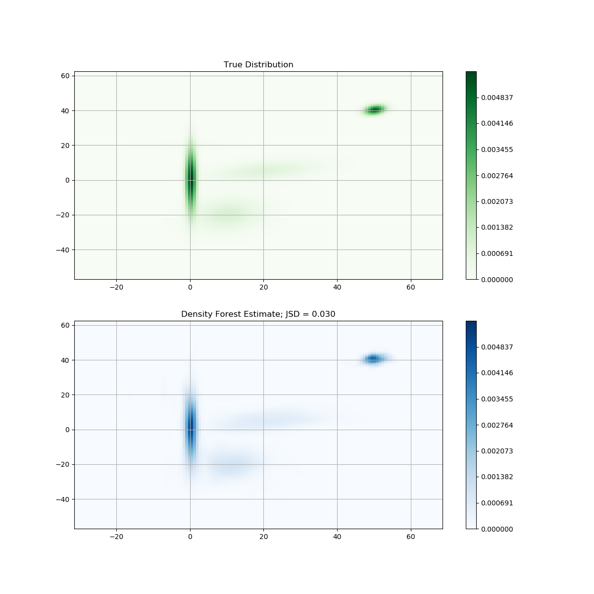

<b>projects </b>

    
			<b>Kiran Sanjeevan Cabeza </b>
    

<a href="https://github.com/ksanjeevan/crnn-audio-classification"><b>crnn-audio-classification </b></a>

    
        
    

pytorch Spectrogram + CNN + LSTM networks for audio classification on the [UrbanSound8K](https://urbansounddataset.weebly.com/urbansound8k.html) dataset

<!---

-->
------

### [ml-image-compression](https://github.com/ksanjeevan/ml-image-compression)
learned image compression based on CNNs in tensorflow

------

### contributions to [pytorch/audio](https://github.com/pytorch/audio)
acknowledgement in the [torchaudio paper](https://arxiv.org/pdf/2110.15018.pdf); implementations such as [phase vocoder](https://github.com/pytorch/audio/pull/131) on GPU, or spectrogram [time and frequency masking](https://github.com/pytorch/audio/pull/285):

------

<a href="https://github.com/ksanjeevan/dourflow"><b> dourflow </b></a>

    
        
    

keras / tensorflow implementation of the state-of-the-art object detection system [_You only look once_](https://pjreddie.com/darknet/yolo/)

------

### contribution to [mlflow](https://github.com/mlflow/mlflow)
changes to allow mlflow docker projects [to use GPU](https://github.com/mlflow/mlflow/pull/2608):

------

### [simple-receptive-field](https://github.com/ksanjeevan/simple-receptive-field)
numerically compute the receptive field of a conv block in pytorch

------

<a href="https://github.com/ksanjeevan/randomforest-density-python"><b> randomforest-density-python </b></a>

    
        
    

density estimation using [random forests](https://en.wikipedia.org/wiki/Random_forest) and [KDE](https://en.wikipedia.org/wiki/Kernel_density_estimation)

------

<a href="https://github.com/ksanjeevan/mapper-tda"><b> mapper-tda </b></a>

    
        
    

implementation of [_Mapper_](http://www.nature.com/articles/srep01236) (Topological Data Analysis technique) for extracting insights from high dimensional data

------
### [torchparse](https://github.com/ksanjeevan/torchparse)
simple pytorch model parser from a .cfg file

------
